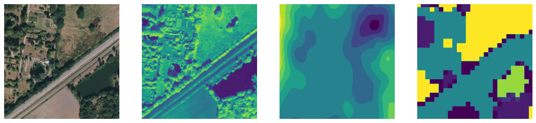
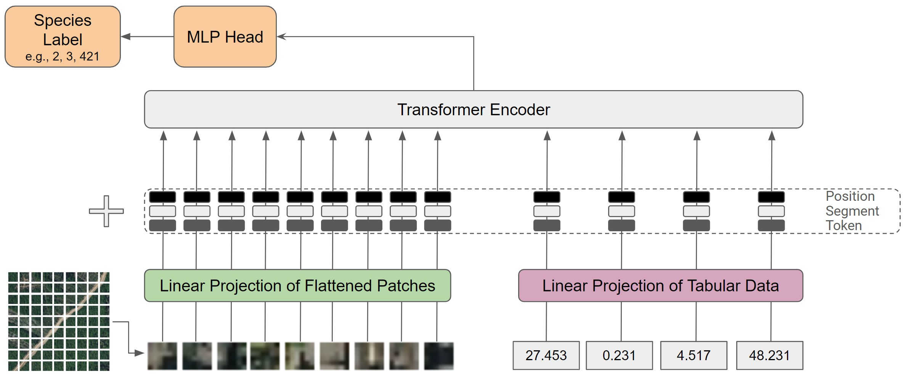
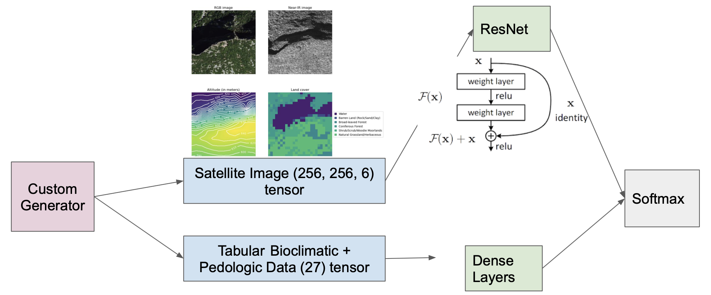
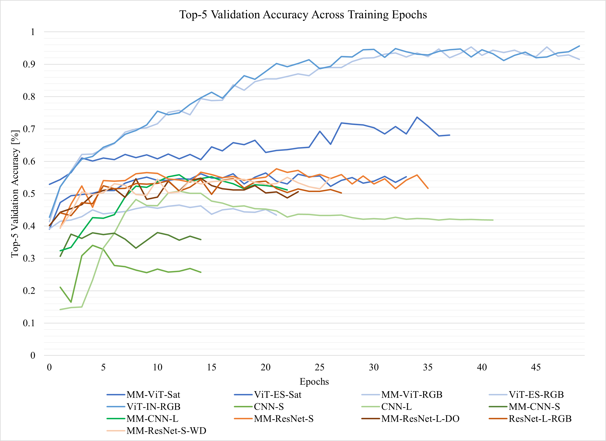
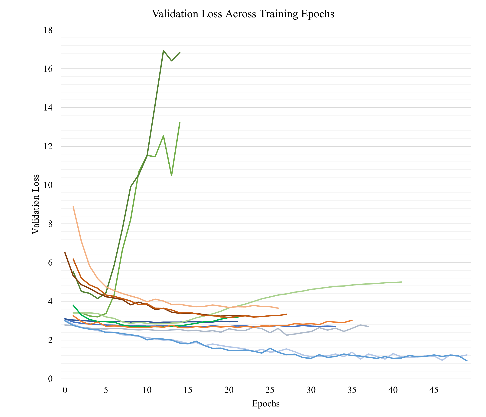

# Location-Based Species Presence Prediction
Submission to the GeoLifeCLEF 2022 - LifeCLEF 2022 x FGVC9 Kaggle competition

# Members
Kennedy Ariana Salamat (kas2319)
Jannik Jerrit Wiedenhaupt (jjw2196)
Nathalie Marie Hager (nmh2147)

# Project Description
The aim of this project is to predict the localization of plant and animal species.
To do so, 1.6M geo-localized observations from France and the US of 17K species are used from the Kaggle competition (9K plant species and 8K animal species). These observations are paired with aerial images and environmental features around them.
The goal is, for each GPS position in the test set, to return a set of candidate species that should contain the true observed species.
Link to Kaggle Competition: https://www.kaggle.com/c/geolifeclef-2022-lifeclef-2022-fgvc9

# Method
We want to use this project to examine the performance differences between convolutional neural networks and vision transformers on image classification. We will provide different ablation studies on their performance differences.

The following conceptual diagrams show the multi-modal architectures, we chose for predicting species based on both images and tabular data.

**Multi-modal Transformer Architecture**

**Multi-modal ResNet Architecture**

# Results
We built several deep learning models (conventional CNNs,
ResNets, and Transformers) in order to solve the problem of species identification.
Ultimately, the best performing architecture on the validation
set were the Transfomers, followed by the ResNets, and then
conventional CNNs. This result shows the superior abilities of
Transformers. It also shows that the specific design structure
of ResNets outperforms even highly-tuned, equally-large (in
terms of parameters) CNNs.
In contrast to the validation set, ResNets performed best on
the test set, followed by conventional CNNs, and then Trans-
formers, suggesting bias in the validation set. Interestingly, the
highest performing Transformers were those trained only on
RGB satellite data, achieving a top-5 accuracy of 95%.

 

# Project Relevance
Automatic prediction of the list of species most likely to be observed at a given location is useful for many scenarios related to biodiversity management and conservation.
First, this would allow us to improve species identification tools - automatic, semi-automatic, or based on traditional field guides - by reducing the list of candidate species observable at a given site. 
More generally, it could facilitate biodiversity inventories through the development of location-based recommendation services (e.g. on mobile phones), encourage the involvement of citizen scientist observers, and accelerate the annotation and validation of species observations to produce large, high-quality data sets.
Finally, this could be used for educational purposes through biodiversity discovery applications with features such as contextualized educational pathways.
